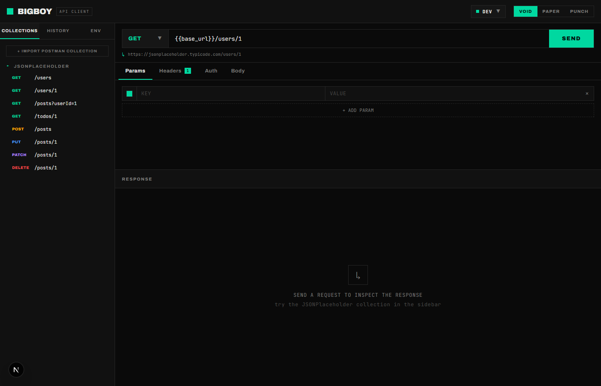
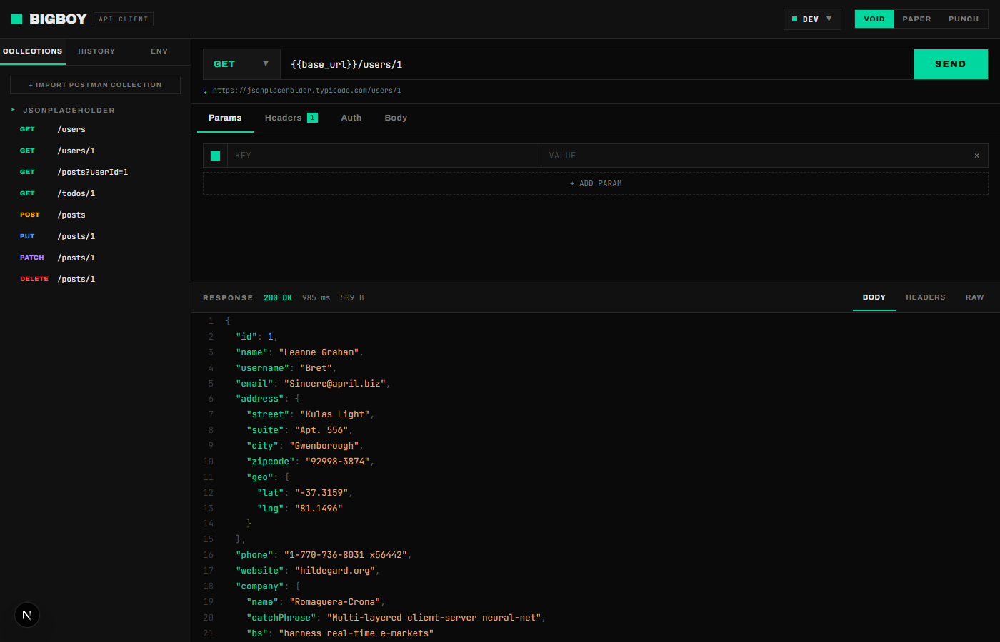
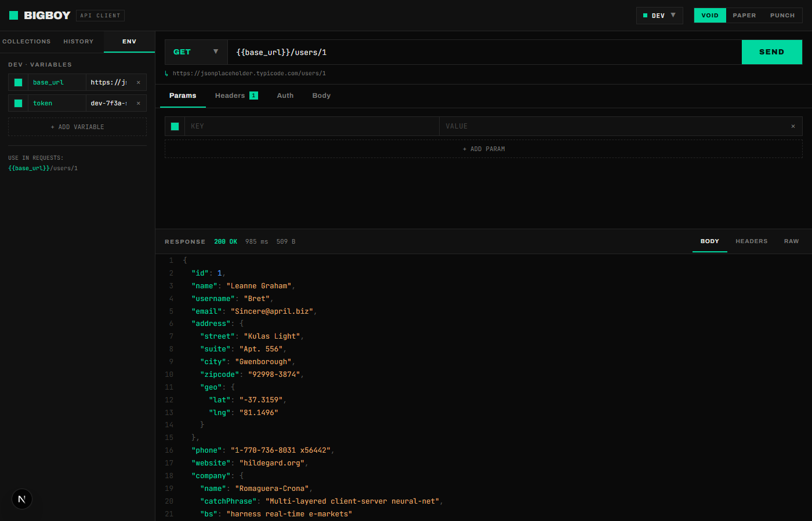

# BigBoy — API Client

> Postman-style browser API testing tool built with Next.js 16, TypeScript, and Zustand.
> Zero installation — runs in any browser via `npm run dev`.

---

## ปัญหาที่แก้ (Problem)

ทีม QA และ Developer มักต้องทดสอบ REST API ระหว่างพัฒนา แต่การติดตั้ง Postman หรือ Insomnia บนทุกเครื่องมีขั้นตอนยุ่งยาก และบางองค์กรมีข้อจำกัดด้านการติดตั้งซอฟต์แวร์

**BigBoy** แก้ปัญหานี้ด้วยการเป็น API client ที่รันบน browser ไม่ต้องติดตั้งอะไรเพิ่มนอกจาก Node.js:

- ทดสอบ API ทุก method (GET / POST / PUT / PATCH / DELETE) ได้จากหน้าเดียว
- จัดการ Environment Variables (DEV / STAGING / PROD) แยกกันได้ ไม่ต้องแก้ URL ทุกครั้งที่เปลี่ยน env
- Import Postman Collection (`.json`) ใช้ต่อได้เลย ไม่ต้องตั้งค่าใหม่
- Proxy server ในตัว (`/api/proxy`) ช่วยข้าม CORS บน localhost
- บันทึก Request History อัตโนมัติ 40 รายการล่าสุด

---

## Screenshots

> ถ่าย screenshot แอปที่รันแล้ววางที่นี่

**หน้าหลัก — VOID Theme (dark)**



**ส่ง GET request และดู JSON response พร้อม syntax highlight**



**Environment Variables panel — สลับ DEV / STAGING / PROD**



**Import Postman Collection**


> หมายเหตุ: สร้างโฟลเดอร์ `screenshots/` แล้วถ่าย screenshot วางที่นี่ก่อน push

---

## Features

| Feature | รายละเอียด |
|---|---|
| HTTP Methods | GET, POST, PUT, PATCH, DELETE |
| Query Params | เพิ่ม/ลบ/toggle แต่ละ row ได้ |
| Request Headers | custom headers พร้อม `Accept: application/json` default |
| Authentication | None / Bearer Token / Basic Auth |
| Request Body | JSON editor + BEAUTIFY button |
| Env Variables | DEV / STAGING / PROD แยก scope, syntax `{{variable}}` |
| Response Viewer | JSON (syntax highlight) / Headers / Raw |
| Request History | บันทึกอัตโนมัติ 40 รายการ, status badge coloured |
| Collections | JSONPlaceholder presets + Postman Collection import |
| Proxy | `/api/proxy` bypass CORS สำหรับ localhost testing |
| Themes | VOID (dark) / PAPER (light) / PUNCH (neon) |

---

## Tech Stack

- **Next.js 16** (App Router) + **React 19**
- **TypeScript** strict mode — Google TypeScript Style Guide
- **Zustand 5** — global state management
- **Jest 30** + **React Testing Library** — unit tests
- **Archivo** (UI font) + **JetBrains Mono** (code font)
- No CSS framework — pure CSS custom properties

---

## การติดตั้ง (Setup)

### Prerequisites

- Node.js 18+ ([nodejs.org](https://nodejs.org))
- npm 9+

### Steps

```bash
# 1. Clone หรือดาวน์โหลด source code
git clone <repo-url>
cd bigboy-project

# 2. ติดตั้ง dependencies
npm install

# 3. รัน development server
npm run dev
```

เปิด [http://localhost:3000](http://localhost:3000) ใน browser

---

## วิธีใช้งาน (Usage)

### 1. ส่ง API Request แรก

```
1. เลือก HTTP Method จาก dropdown ซ้ายมือ (GET / POST / ...)
2. พิมพ์ URL ในช่อง เช่น  https://jsonplaceholder.typicode.com/users/1
3. กดปุ่ม  SEND
4. ดูผลลัพธ์ใน Response panel ด้านขวา (JSON / Headers / Raw)
```

### 2. ใช้ Environment Variables

```
1. คลิก ENV dropdown บน TopBar → เลือก DEV / STAGING / PROD
2. ไปที่ sidebar tab "ENV" → แก้ไขค่า base_url, token
3. ใช้ syntax  {{base_url}}/users/1  ใน URL bar
4. ค่าจะถูก interpolate อัตโนมัติก่อน send
```

### 3. Import Postman Collection

```
1. Export collection จาก Postman เป็นไฟล์ .json (v2.1 format)
2. คลิก "IMPORT" บน sidebar COLLECTIONS tab
3. เลือกไฟล์ → requests ทั้งหมดจะปรากฏใน sidebar
4. คลิก request ใดก็ได้เพื่อ load เข้า request builder
```

### 4. ตัวอย่าง POST request

```
Method:  POST
URL:     {{base_url}}/posts
Body:    {
           "title": "Hello BigBoy",
           "body": "Testing from browser",
           "userId": 1
         }
→ กด SEND → Response: 201 Created  { "id": 101, ... }
```

---

## ผลลัพธ์การทำงาน (Results)

### JSON Response พร้อม Syntax Highlight

```json
{
  "id": 1,
  "name": "Leanne Graham",
  "username": "Bret",
  "email": "Sincere@april.biz",
  "company": {
    "name": "Romaguera-Crona",
    "catchPhrase": "Multi-layered client-server neural-net"
  }
}
```

Status แสดงสี: `200 OK` (accent green) / `404 Not Found` (amber) / `500 Error` (red)
Time และขนาด response แสดงที่ response bar เสมอ

### Request History

ทุก request ที่ส่งจะถูกบันทึกอัตโนมัติใน sidebar History tab:
```
GET  /users/1  45ms  200  14:32:01
POST /posts    120ms 201  14:33:15
```

---

## Tests

```bash
# รัน tests ทั้งหมด
npm test

# รัน พร้อม coverage report
npm run test:coverage
```

ผลลัพธ์ล่าสุด: **272 tests ผ่านทั้งหมด** ใน 17 test suites

| Test Suite | Coverage |
|---|---|
| `lib/httpClient` | buildUrl, buildHeaders, fmtSize, mock — Happy Path + Edge Cases |
| `lib/envInterpolation` | subst() ทุก scenario |
| `lib/themes` | theme tokens, CSS var generation |
| `store/appStore` | state actions ทุก action |
| `components/*` | render tests ทุก component หลัก |

---

## Project Structure

```
bigboy-project/
├── app/
│   ├── layout.tsx          # root layout + font loading
│   ├── page.tsx            # entry point → AppShell
│   └── api/proxy/route.ts  # CORS proxy (Next.js Route Handler)
├── components/
│   ├── layout/             # TopBar, Sidebar
│   ├── request/            # UrlBar, RequestTabs, Params/Headers/Auth/Body panels
│   ├── response/           # ResponseBar, JsonViewer, RawViewer
│   ├── sidebar/            # Collections, History, Environments panels
│   └── ui/                 # KeyValueRow (shared component)
├── hooks/
│   └── useApiRequest.ts    # fetch logic + history recording
├── lib/
│   ├── envInterpolation.ts # {{variable}} substitution
│   ├── httpClient.ts       # buildUrl, buildHeaders, fmtSize, mock
│   ├── jsonHighlight.tsx   # syntax highlight renderer
│   ├── postmanImport.ts    # Postman v2.1 collection parser
│   └── themes.ts           # theme tokens + CSS var mapping
├── store/
│   └── appStore.ts         # Zustand global store
├── types/
│   └── index.ts            # shared TypeScript types
└── __tests__/              # Jest test suites
```

---

## Lesson Learned

### 1. Prompt Engineering ชัดเจน = โค้ดที่ไม่ต้องแก้ซ้ำ

การระบุ constraint ใน prompt ให้ครบ (TypeScript strict, Google Style Guide, naming convention, no any) ทำให้ Claude Code สร้างโค้ดที่ใช้ได้เลยโดยไม่ต้อง refactor ทีหลัง

### 2. Test-first ช่วยจับ edge case ที่มองข้าม

เมื่อให้ Claude Code เขียน unit tests ก่อน จะพบว่า `buildUrl()` มี edge case เรื่อง param ที่ `key === ''` และ `on === false` ที่ไม่เคยนึกถึงตอนเขียน implementation

### 3. Proxy route แก้ CORS ได้ แต่ต้องระวัง SSRF

การมี `/api/proxy` ทำให้ทดสอบ API บน localhost ได้โดยไม่ติด CORS แต่ endpoint นี้ไม่มี URL validation ซึ่งเป็น security risk (SSRF) ในสภาพแวดล้อม production ต้องเพิ่ม allowlist

### 4. CSS Custom Properties ยืดหยุ่นกว่า Tailwind สำหรับ theming

การใช้ `var(--accent)`, `var(--bg)` ทั้งโปรเจกต์ทำให้เปลี่ยน theme ได้ด้วย JavaScript object เดียว โดยไม่ต้อง rebuild CSS

### 5. Zustand ง่ายกว่า Context สำหรับ state ที่ share ข้าม component tree ลึก

การมี single store ทำให้ component ที่อยู่ลึกใน tree (เช่น `KeyValueRow`) สามารถ dispatch action ได้โดยตรง ไม่ต้อง prop drill

---

## License

MIT — สร้างสำหรับ Final Project: Claude Code for Developer (BornToDev, 2026)
